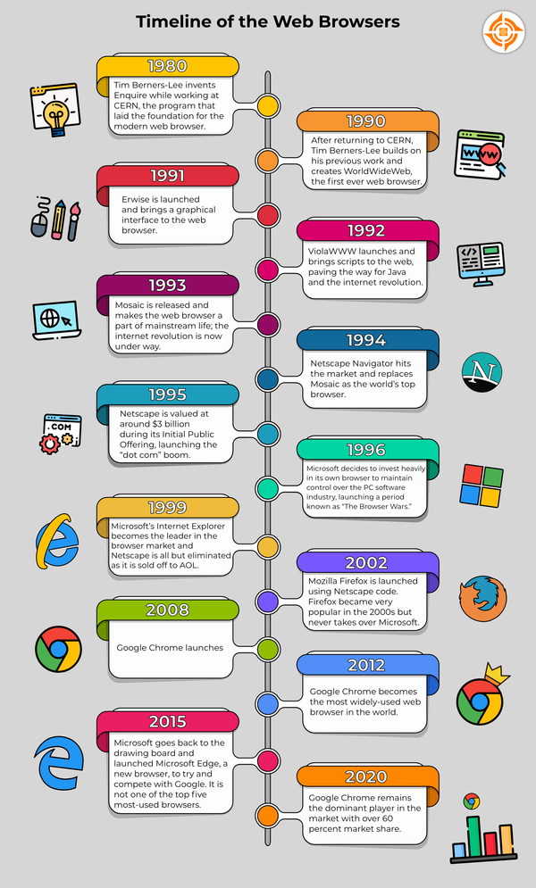
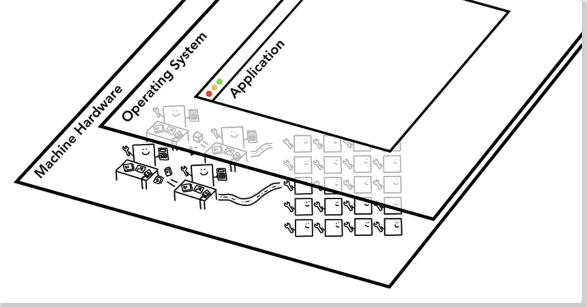
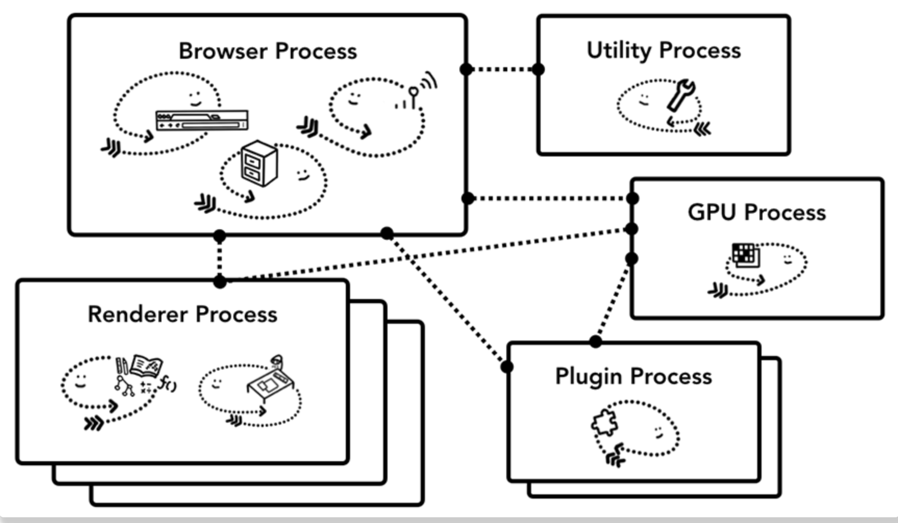
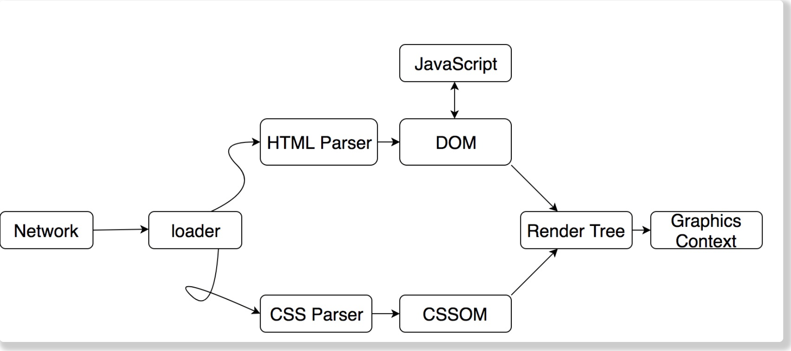

 

  

# Browser🔧

浏览器，是我们获取外界信息的重要工具，它的功能有很多，比如：

- **browser the websit**

- **watch video**

- **access to information**

- **coding**

**However**，浏览器在刚诞生的时候，仅仅只能展示一些简单的文本，它是如何一步步发展到今天这样呢？

下面我们就来一探究竟

## History

### Pre Web Era💻

时间回到1950年，当时一台计算机需要占据一整个房间，而性能却比不上现在的微型计算机，但技术发展日新月异，到了 1960 年，它已能运行复杂的程序。全球各国政府和大学都认为，如果这些机器可以相互连通以促进合作共赢和科学突破，那将是一件大好事。

阿帕网（ARPANET）是第一个成功的网络连接计划，1969 年，第一条消息从美国加州大学洛杉矶分校（UCLA）计算机科学实验室发送到同样位于加州的斯坦福研究院（Stanford Research Institute, SRI）

由此，引发了计算机网络的一场革命。之后不同的网络相继建立，连接了全球的各所大学与研究中心。但在接下来的20年里，公众仍无法访问互联网，只有大学与政府机关内的研究人员、学生与私人企业可以使用。真正开放的互联网与第一款Web浏览器，直到 1990 年才显露雏形。

> 💡Tips: 超文本标记语言HTML(HyperText Markup Language)，最初的设计目的是为了方便各国的学者和科学家编写资料用于交流，而不是设计网页

### The Web Age

1990年，第一款浏览器问世于互联网之父Tim Berners-Lee(蒂姆·伯纳斯·李)工作期间。当时的浏览器仅仅只是一款计算机程序，其目的是检索数据。并以易于理解的方式向您解释和呈现计算机代码。

1990年浏览器诞生之后的故事：

首先出场的是NCSA Mosaic。它于1993年发布，是互联网历史上第一个获普遍使用和能够显示图片的网页浏览器。

1994年，Mosaic的原作者推出了Netscape，它在网页中使用了JavaScrip，大大改善了用户的在线体验。Netscape一经发布迅速走红，最疯狂的时候，它占据了接近百分之九十的市场份额。

> 💡Tips:1995 年 8 月 9 日，网景公开募股，最初的价格是 14 美元一股，但后来阴差阳错，改为 28 美元一股发行，当天收盘时，网景的股票成了 75 美元一股，网景成为了当时世界上市值最高的互联网公司，Netscape 的 IPO 也助长了日益增长的网络泡沫。

1990年代后期创建了自己的浏览器 Internet Explorer(IE)，并且和Windows捆绑发布，这使其能够在市场上占据一席之地并不断发展壮大，最终在浏览器领域取得了胜利，这就是著名的第一次浏览器大战

到2003年，微软的Internet Explorer控制了92%以上的市场。故事到这里似乎已经结束了。然而，正如最初发布后的情况一样，Internet Explorer正在成为劣质产品

2008年Google推出了其专有浏览器——Chrome。到2012年底，即推出仅四年后，谷歌 Chrome 浏览器凭借其易用性、跨平台功能、速度以及与标签和书签相关的特殊功能，取代 Internet Explorer 成为最受欢迎的浏览器。

而Internet Explorer 的流行度却在逐渐减少，主要是因为它变得缓慢和过时，而 Microsoft 发现这个问题时，自己似乎已经是一个局外人。该公司不想继续错过，于是着手解决这个问题，但发现一个关键问题是“Internet Explorer”这个名字已经成为劣质浏览器的同义词。因此，为了尝试重新进入游戏，Microsoft不得不重新命名，于是Edge诞生了。Edge是Microsoft浏览器的最新版本，它受到了很多好评，但对于Microsoft来说，Edge 的出现可能为时已晚。而IE也终成时代的眼泪，它将从Windows11中消失，并在2022停止更新。

> 💡Tips:在2000年代初期，可能是在Microsoft将浏览器附加到其操作系统之后，Apple发布了Safari，一种专为 Mac 设计的浏览器，并成为目前市场上第二大浏览器
>
> 💡Tips:Edge浏览器于2015年发布；2017年10月，微软上线了基于Chromium的 Android版Edge，2018年12月，微软放弃EdgeHTML引擎开发，PC版Edge直接采用Chromium

  

## Web page🏭

网页是浏览器用于展示各种信息的平台，它主要由HTML、CSS、JavaScript和其它静态资源(video、audio)文件组成。

浏览器在渲染一个网页时，犹如一座组织严密的工厂，网页就是要组装的产品。当用户通过浏览器打开一个网页时，它会向网站部署的服务器发送请求获取组成当前网页的原材料，然后经过浏览器内核一道道工序的加工，最终将组装好的网页展示在我们面前。

### Browser process model

不同浏览器的进程模型可能有所不同，以Chrome浏览器为例：

多进程架构：

上图中，顶部是浏览器进程，它与处理应用其它模块任务的进程进行协调。对于渲染进程来说，创建了多个渲染进程并分配给了每个标签页。Chrome 在可能的情况下会给每个标签页分配一个进程。而现在它试图给每个站点分配一个进程，包括iframe。

- 浏览器进程：控制应用中的 “Chrome” 部分，包括地址栏，书签，回退与前进按钮，以及处理 web 浏览器中网络请求、文件访问等不可见的特权部分；
- 插件进程：控制站点使用的任意插件，如 Flash；
- GPU 进程：处理独立于其它进程的 GPU 任务。GPU 被分成不同进程，因为 GPU 处理来自多个不同应用的请求并绘制在相同表面。
- 渲染进程：控制标签页内网站展示，解析HTML，CSS，运行JavaScript等都在这个进程中；

## Busy rendering process

浏览器内核就是指浏览器最重要或者说核心的部分”Rendering Engine”，译为”渲染引擎”，即渲染进程。渲染进程是浏览器中最为繁忙的进程，它是一个多线程架构，包含了以下几个线程：

- JS主线程：执行Js脚本
- GUI渲染线程
- 事件触发线程
- 计时器触发线程
- http请求线程

它处理的任务包括但不限于：

- 解析HTML
- 解析CSS
- 计算样式、布局
- 处理图层、渲染页面
- 执行JS代码
- 执行事件处理函数
- 执行计时器回调函数等

### HTML CSS

当浏览器拿到服务器返回的网页原材料时，GUI线程首先会解析HTML，CSS生成对应的DOM树，两者合并生成渲染树，然后进行排版，渲染

### JavaScript

当遇到JS脚本要开始执行时，GUI渲染线程会停止解析，JS主线程开启，执行JS代码。

最开始的时候，JS线程会进入一个无限循环，循环检查宏任务队列中是否有任务存在。如果有，就取出第一个任务执行；执行完该任务中的同步代码后，会检查微任务队列中是否有代码，如果有，则依次执行完微任务队列中的所有任务；然后进行页面渲染的，最后进入下一次循环；如果没有，则进入休眠状态。

> ❓Question: requestAnimationFrame，requestIdentCallback的调用时机分别在哪？

## The End🔚

随着互联网的快速发展，现代浏览器不仅仅是一个展示信息的工具，更像是一个操作系统；基于它内核到强大性能，它的衍生技术已经扩展到互联网各个领域。前端(JavaScript)、后端(NodeJs)、桌面端(Electron)、移动端APP(React Native)都有它的身影。

> Any application that can be written in JavaScript, willeventually be written in JavaScript.
> &nbsp; &nbsp; &nbsp; &nbsp; &nbsp; &nbsp; &nbsp; &nbsp; &nbsp; &nbsp; &nbsp; &nbsp; &nbsp; &nbsp; &nbsp; &nbsp; &nbsp; &nbsp; &nbsp; &nbsp; &nbsp; &nbsp; &nbsp; &nbsp; &nbsp; &nbsp; &nbsp; &nbsp; &nbsp; &nbsp; &nbsp; &nbsp; &nbsp; &nbsp; &nbsp; &nbsp; &nbsp; &nbsp; &nbsp; &nbsp; &nbsp; &nbsp; &nbsp; &nbsp; &nbsp; &nbsp; &nbsp; &nbsp; &nbsp; &nbsp; &nbsp; &nbsp; &nbsp; &nbsp; &nbsp; &nbsp; &nbsp; &nbsp; &nbsp; &nbsp; &nbsp; &nbsp; &nbsp; &nbsp; &nbsp; &nbsp; &nbsp; &nbsp; &nbsp; &nbsp; &nbsp; &nbsp; &nbsp; &nbsp; &nbsp; --Jeff Atwood